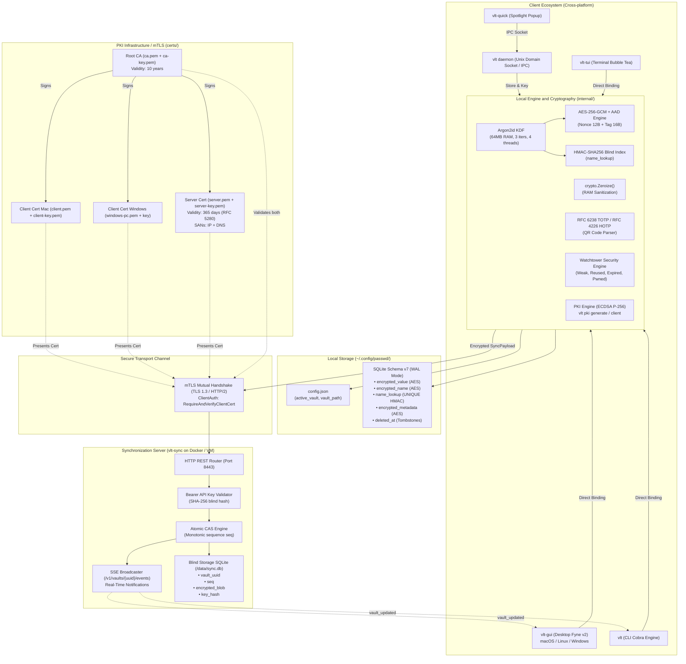
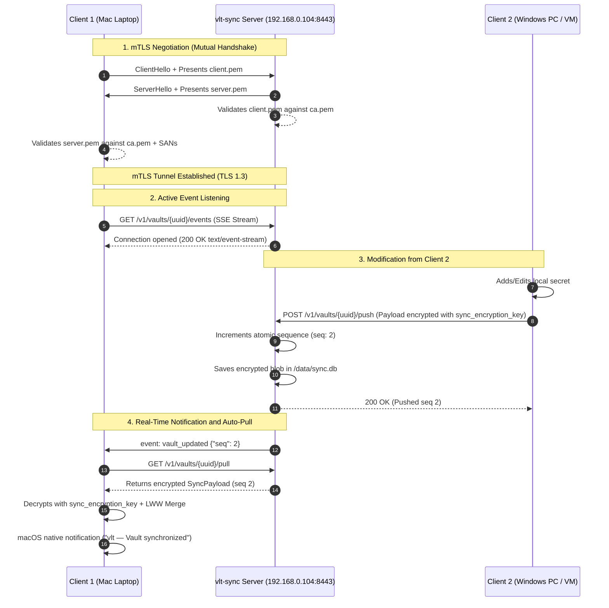

# Complete Architecture of vlt — Mermaid Diagrams

[English](ARCHITECTURE-MERMAID.md) | [Español](es/ARCHITECTURE-MERMAID.md)

This document contains the comprehensive visual representation of the **`vlt`** system architecture, covering everything from the user interfaces and local cryptographic subsystem to the mTLS certificate PKI infrastructure and the real-time Zero-Knowledge synchronization protocol.

---

## 1. General System Architecture

---

## 2. Cryptographic Derivation and Local Storage Flow

---

## 3. Complete mTLS Synchronization and Real-Time Events Flow

