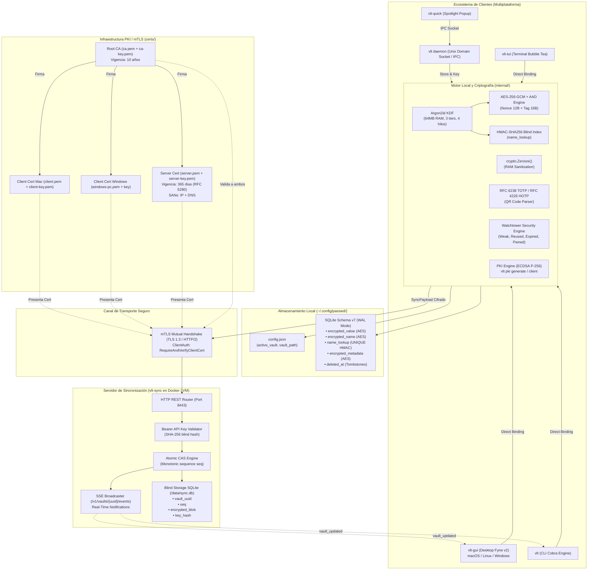

# Arquitectura Completa de vlt — Diagramas Mermaid

Este documento contiene la representación visual exhaustiva de la arquitectura del sistema **`vlt`**, abarcando desde las interfaces de usuario y el subsistema criptográfico local hasta la infraestructura PKI de certificados mTLS y el protocolo de sincronización Zero-Knowledge en tiempo real.

---

## 1. Arquitectura General del Sistema

---

## 2. Flujo de Derivación Criptográfica y Almacenamiento Local

```mermaid
sequenceDiagram
    autonumber
    actor Usuario
    participant UI as Interfaz (CLI / GUI / TUI)
    participant KDF as Argon2id Engine
    participant Crypto as AES-256-GCM / HMAC
    participant RAM as Memoria Volátil
    participant DB as SQLite (Schema v7)

    Usuario->>UI: Ingresa Master Password
    UI->>DB: Lee salt y verify_hash (tabla config)
    UI->>KDF: Deriva clave de 32 bytes (64MB RAM, 3 iters)
    KDF->>RAM: Almacena derivedKey
    
    rect rgb(25, 45, 60)
        Note over UI,Crypto: Cifrado de Secreto
        UI->>Crypto: Cifra payload con derivedKey + AAD
        Crypto->>Crypto: Calcula name_lookup = HMAC(derivedKey, "passwd.name." + name)
        Crypto->>DB: INSERT / UPDATE en SQLite (Solo Ciphertext)
    end
    
    UI->>RAM: crypto.Zeroize(masterPassword)
    Note over RAM: La contraseña en texto plano se destruye en RAM
```

---

## 3. Flujo Completo de Sincronización mTLS y Eventos en Tiempo Real

